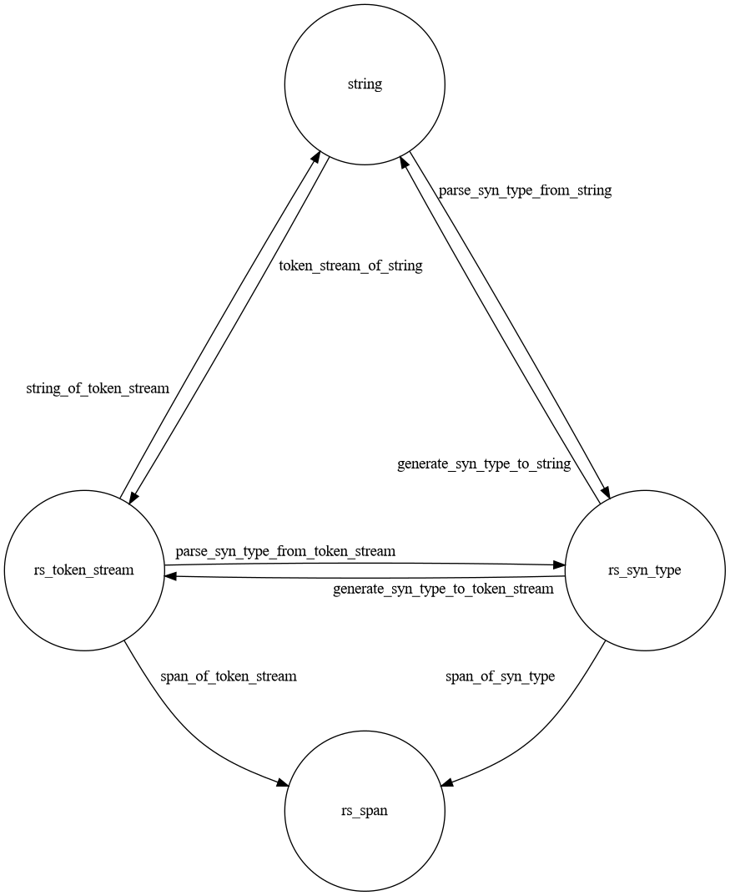

ocaml-rust-parser-generator
===

This is a library for parsing and generating Rust in OCaml. It is essentially
(mostly automatically) generated bindings
for [syn](https://github.com/dtolnay/syn)
and [proc-macro2](https://github.com/alexcrichton/proc-macro2).

## Architecture

Data is communicated to and from OCaml
using [the `Marshal` module](https://ocaml.org/api/Marshal.html). Data
structures are serialized to and deserialized from the corresponding binary
format and given to taken or from OCaml in the form of `bytes`. To simplify
writing functions that are executed from
OCaml, [ocaml-rs](https://github.com/zshipko/ocaml-rs) is used.

The modules of the project are in following folders:

* [`generator`](generator), a generator written in Rust
* [`rust-lib`](rust-lib), a Rust library that is loaded from OCaml
* [`ocaml-lib`](generator), an OCaml library to be used by the end users

The main files containing code are:

* [`generator/src/main.rs`](generator/src/main.rs), which
  generates [from the `syn.json` file](https://docs.rs/syn-codegen/0.2.0/syn_codegen/)
  the following files:
    * [`rust-lib/src/generated.rs`](rust-lib/src/generated.rs) with marshaling
      code and parsing/generating code (if applicable) for each `syn` type
    * [`ocaml-lib/ocaml_rust_parser_generator.mli`](ocaml-lib/ocaml_rust_parser_generator.mli)
      with types definitions and functions
    * [`ocaml-lib/ocaml_rust_parser_generator.ml`](ocaml-lib/ocaml_rust_parser_generator.ml)
      with implementations that call the functions from the `Marshal` module and
      functions from the Rust library
* [`rust-lib/src/lib.rs`](rust-lib/src/lib.rs) with `MarshalingOutput`
  and `MarshalingInput` structs for marshaling OCaml values and hand-written
  marshaling code for some particular types

## API

Below `SynType` mean almost any
of [the `syn` types](https://docs.rs/syn/1.0.72/syn/#structs).

```ocaml
type rs_syn_type = ...

val token_stream_of_string : string -> rs_token_stream
val string_of_token_stream : rs_token_stream -> string

val parse_syn_type_from_token_stream : rs_token_stream -> rs_syn_type
val parse_syn_type_from_string : string -> rs_syn_type

val generate_syn_type_to_token_stream : rs_syn_type -> rs_token_stream
val generate_syn_type_to_string : rs_syn_type -> string
```



## Building and running

The library can be built by executing the following command (Rust
with `cargo-expand`, which can be installed using the
command `cargo install cargo-expand`, and OCaml with Dune are required):

```shell
make build
```

An example, which demonstrates the usage of the library (round tripping a Rust
file and getting parts from it) and also how Rustfmt can be used to make the
output better (the `shexp` package from OPAM is required), can be run by
executing the following command:

```shell
make example
```

## License

This project is licensed under either of

* Apache License, Version 2.0, ([LICENSE-APACHE](LICENSE-APACHE) or
  http://www.apache.org/licenses/LICENSE-2.0)
* MIT license ([LICENSE-MIT](LICENSE-MIT) or
  http://opensource.org/licenses/MIT)

at your option.
